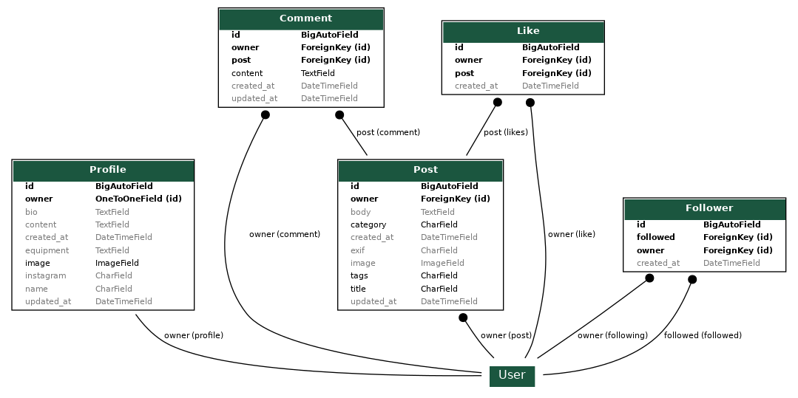

<h1 align="center">TravelShutter: Django Rest Framework API</h1>

<h3 align="center">Back-end application for front-end React project</h3>

<br>


**Developer:** Aleksander Kisielewicz

**[View live api here](https://drf-travelshutter.herokuapp.com/)** :computer:

TravelShutter API was developed as a part of Portfolio Project #5 (advanced front-end) for Diploma in Full Stack Software Development at [Code Institute](https://www.codeinstitute.net).

Project purpose was to build a back-end application that provides data and full CRUD (create, read, update, delete) functionality to React front-end application.

- Deployed front-end: [travel-shutter.herokuapp.com](https://travel-shutter.herokuapp.com/)
- Front-end repo: [github](https://github.com/alexkisielewicz/travel-shutter)

# Table of content

- [Project](#project)
  - [Agile Methodology for project planning](#agile-methodology-for-project-planning)
- [Logic and features](#logic-and-features)
  - [Database model and database structure](#data-model-ad-database-structure)
- [Technology](#technology)
  - [Python libraries/modules](#python-librariesmodules)
- [Testing](#testing)
  - [Manual testing](#manual-testing)
- [Deployment](#deployment)
  - [Database](#database-elephangsql)
  - [Cloudinary](#cloudinary)
  - [Django secret key](#django-secret-key)
  - [Github and Gitpod](#github-and-gitpod)
  - [Heroku](#heroku)
- [Possible future development](#possible-future-development)
- [Credits](#credits)
  - [Code](#code)

# Project

## Agile Methodology for project planning

[Project's Kanban board @GitHub Projects](https://github.com/users/alexkisielewicz/projects/3)

[Project's Table view @GitHub Projects](https://github.com/users/alexkisielewicz/projects/3/views/2)

To keep track of progress, I used a kanban board divided into following sections: "to do", "in progress" "done" and "future enhancements" that allowed to visualize all tasks and prioritize next steps.

By using agile methodology, I was able to stay organized and focused on delivering the most important features, while also allowing flexibility for future development.

| Milestone | User story   |
|-----------|--------------|
| Profile app |  [#1](https://github.com/alexkisielewicz/drf-travelshutter/issues/1) As a user, I want to be able to create a profile, so I can provide information about myself.|
| Profile app | [#2](https://github.com/alexkisielewicz/drf-travelshutter/issues/2) As a user, I want to be able to edit my profile, so I can update my name, bio, and Instagram handle. |
| Profile app | [#3](https://github.com/alexkisielewicz/drf-travelshutter/issues/3) As a user, I want to be able to upload an image for my profile picture, so I can personalize my profile. |
| Profile app | [#4](https://github.com/alexkisielewicz/drf-travelshutter/issues/4) As a user, I want my profile to display the date and time it was created and edited so I can see when my profile was established and updated. |
| Profile app | [#5](https://github.com/alexkisielewicz/drf-travelshutter/issues/5) As a user, I want my default profile picture to be set if I haven't uploaded a custom image, so my profile always has an image present.|
| Profile app | [#6](https://github.com/alexkisielewicz/drf-travelshutter/issues/6) As a site admin, I want profiles to be automatically created when users sign up for an account, so I don't have to manually create it. |
| Post app | [#7](https://github.com/alexkisielewicz/drf-travelshutter/issues/7) As a user, I want to be able to create a new post by providing a title, category, optional EXIF data, post content, and an image. |
| Post app | [#9](https://github.com/alexkisielewicz/drf-travelshutter/issues/9) As a user, I want to be able to view the details of a specific post, including its title, category, creation time, and other optional fields. |
| Post app | [#10](https://github.com/alexkisielewicz/drf-travelshutter/issues/10) As a user, I want to be able to update my posts and be able to delete them.|
| Post app | [#11](https://github.com/alexkisielewicz/drf-travelshutter/issues/11) As a user, I want to be able to filter posts by provided fields, so that I can see posts related to specific criteria. |
| Post app | [#12](https://github.com/alexkisielewicz/drf-travelshutter/issues/12) As a user, I want to be able to search for posts by their title or content, so that I can find posts that contain specific keywords. |
| Post app | [#13](https://github.com/alexkisielewicz/drf-travelshutter/issues/13) As a user, I want to be able to upload an image for a post and have it displayed along with other post details. |
| Post app | [#22](https://github.com/alexkisielewicz/drf-travelshutter/issues/22) As a user I want to be able to add tags to my posts and be able to display tagged posts so I can easily find the content that I'm interested in. |
| Comments app | [#14](https://github.com/alexkisielewicz/drf-travelshutter/issues/14) As a user, I want to be able to add a comment to a specific post. |
| Comments app | [#15](https://github.com/alexkisielewicz/drf-travelshutter/issues/15) As a user, I want to be able to edit the comments that I have posted. |
| Comments app | [#16](https://github.com/alexkisielewicz/drf-travelshutter/issues/16) As a user, I want to be able to delete a comment that I have posted. |
| Comments app | [#17](https://github.com/alexkisielewicz/drf-travelshutter/issues/17) As a user, I want to be able to see the total number of comments I have posted. |
| Comments app | [#18](https://github.com/alexkisielewicz/drf-travelshutter/issues/18) As a user, I want to be able to view the details of a specific comment, including its content, creation time, and the associated post. |
| Likes app | [#19](https://github.com/alexkisielewicz/drf-travelshutter/issues/19) As a user, I can post a "like" or remove it for a specific post. |
| Likes app | [#20](https://github.com/alexkisielewicz/drf-travelshutter/issues/20) When I view a post, I can see the list of likes it has received with details such as users who added likes, and time added. |
| Followers app | [#21](https://github.com/alexkisielewicz/drf-travelshutter/issues/21) As a user, I want to be able to follow other users and see who is following me.) |
| Followers app | [#23](https://github.com/alexkisielewicz/drf-travelshutter/issues/23) As a user, I want to be able how many users follow me, and also how many users I follow, so I can keep track of the popularity of my profile.) |

# Logic and features

## Data model ad database structure

Project uses cloud-based PostgreSQL database provided by [ElephantSQL](https://www.elephantsql.com/) as a service. ElephantSQL is known for its ease of use, reliability, and is a popular choice for Django projects that requires PostgreSQL database. It offers web interface with console for SQL queries. Database URL including API key is stored as enviromental variable in heroku.

To generate model diagrams I used django-extensions with [python library pygraphviz](https://medium.com/@yathomasi1/1-using-django-extensions-to-visualize-the-database-diagram-in-django-application-c5fa7e710e16). They show relationship between models.

All django apps:



| Model | Description |
|-------|-------------|
| Profile |  The Profile model represents a user profile. It is associated with the User model through a one-to-one relationship. The model includes fields such as name, bio, equipment, and instagram to capture relevant informaiton for further frond-end use. Time fields are also present to track timestamps. Default profile image is provided if user didn't upload his own.|
| Post | This model represents a website post and contains fields for the post's title, owner, category, tags, image, location, content, creation and update times. |
| Comments | This model represents a comment on a website's post and contains fields for the post it belongs to, the commenter's name, comment's body, and creation/update time. |
| Likes | This model represents likes on a website's post and contains fields for the post it belongs to, the owner and timestamp. |
| Followers | This model represents the relationship between user profiles. It allows users to follow each other by establishing a many-to-many relationship. |

Model profiles


Model posts


Model comments


Model likes


Model followers


# Technology

## Languages used

- [Python](https://www.python.org/) - high-level, imperative, general-purpose programming language.
- [Markdown](https://en.wikipedia.org/wiki/Markdown) - markup language used to write README and TESTING documents.

## Software used

- [Cloudinary](https://cloudinary.com/) - cloude-based image and video API
- [Django](https://www.djangoproject.com/) - python-based web framework with MTV architectural pattern
- [Django Rest Framework](https://www.django-rest-framework.org/) - powerful and flexible toolkit for building Web APIs.
- [ElephantSQL](https://www.elephantsql.com/) - PostgreSQL database as a service
- [Git](https://git-scm.com/) - Git was used for version control by utilizing the Gitpod terminal to commit to Git and Push to GitHub
- [GitHub](https://github.com/) - GitHub is used to store the project's code after being pushed from Git
- [Heroku](https://heroku.com) - online app used to deploy project

## Python libraries/modules

- [os](https://docs.python.org/3/library/os.html) - built-in Pythod module - used to save and import env variables
- [cloudinary](https://pypi.org/project/cloudinary/) - cloud hosting used to store pictures
- [dj3-cloudinary-storage](https://pypi.org/project/dj3-cloudinary-storage/) - provides django integration with Cloudinary service
- [dj-database-url](https://pypi.org/project/dj-database-url/0.5.0/) - utility that allows configure environment variable to a connection string that includes the database engine
- [django-allauth](https://pypi.org/project/django-allauth/) - integrated django accounts management
- [django-cors-headers](https://pypi.org/project/django-cors-headers/) - handles the server headers required for cross-origin resource sharing (CORS)
- [Django Filters](https://pypi.org/project/django-filter/) - reusable Django application allowing users to declaratively add dynamic QuerySet filtering from URL parameters
- [gunicorn](https://pypi.org/project/gunicorn/) - Python WSGI HTTP Server for UNIX
- [oauthlib](https://pypi.org/project/oauthlib/) - framework for implementing open standard for authorization
- [psycopg2](https://pypi.org/project/psycopg2/) - PostgresSQL database adapter for Python language
- [PyJWT](https://pypi.org/project/PyJWT/) - Python library for encoding, decoding and veryfying JSON Web Tokens
- [pytz](https://pypi.org/project/pytz/) -  library that provides support for working with time zones, converts the dates between zones
- [requests-oauthlib](https://pypi.org/project/requests-oauthlib/) - OAuth library suppor for python requests
- [sqlparse](https://pypi.org/project/sqlparse/) - non-validating SQL parser for Python. It provides support for parsing, splitting and formatting SQL statements.
- [pygraphviz](https://pypi.org/project/pygraphviz/) - used to generate visualization of database model
- [PyJWT](https://pypi.org/project/PyJWT/) - JSON Web Token implementation in Python
- [Pillow](https://pillow.readthedocs.io/en/stable/index.html) - Pillow adds image processing capabilities to Python interpreter

# Testing

## Manual testing

Details of manual testing can be found in [TESTING.md](TESTING.md) file.

# Deployment

App was deployed to heroku for the first time when django installation was completed to make sure that everything is working correctly.

## Database (ElephangSQL)

1. Navitate to [ElephantSQL website](https://www.elephantsql.com/), log in to your account
2. In top-right corner click on green button "Create New Instance".
3. Enter database name, leave plan field as is, optionaly enter tags.
4. Select region, click on "Review" and then on "Create instance".
5. Go to your dashboard, find newly created database instance, click on it.
6. Copy URL starting with "postgress://"
7. Paste this URL into env.py file as DATABASE_URL value and save the file.

  ```python
  os.environ["DATABASE_URL"] = "postgres://yourLinkFromDatabaseDashboard"
  ```

## Cloudinary

1. Navigate to [https://cloudinary.com/](https://cloudinary.com/) and log in to your account.
2. Navigate to dashboard/console [https://console.cloudinary.com/console/](https://console.cloudinary.com/console/) and copy API Enviroment variable starting with "cloudinary://".
3. Paste copied url into env.py file as CLOUDINARY_URL value and save the file.

```python
os.environ["CLOUDINARY_URL"] = "cloudinary://yourLinkFromCloudinaryDashboard"
```

## Django secret key

In order to protect django app secret key it was set as anviroment variable and stored in env.py. Please change your password accordingly.

```python
os.environ["SECRET_KEY"] = "yourSecretKey"
```

## GitHub and Gitpod

Note: Repository was created using Code Institute template: [https://github.com/Code-Institute-Org/ci-full-template](https://github.com/Code-Institute-Org/ci-full-template)

1. Login to Github and navigate to repository: [https://github.com/alexkisielewicz/drf-travelshutter](https://github.com/alexkisielewicz/drf-travelshutter)

2. Click on "Fork button" in upper-right corner and create a new form in your own account.

3. Open your repository in local IDE or using Gitpod. Preferred way is to used [Chrome Gitpod Extension](https://chrome.google.com/webstore/detail/gitpod-always-ready-to-co/dodmmooeoklaejobgleioelladacbeki). When you install extension, green "Gitpod" button appears in your repository. Click on it to cread new workspace.

4. Go to workspace terminal and install all requirements using command: "pip install -r requirements.txt". All te packages will be installed. requirements.txt content:

    ```python
    asgiref==3.7.2
    cloudinary==1.33.0
    dj-database-url==0.5.0
    dj-rest-auth==2.1.9
    Django==3.2.19
    django-allauth==0.44.0
    django-cloudinary-storage==0.3.0
    django-cors-headers==4.0.0
    django-filter==23.2
    djangorestframework==3.14.0
    djangorestframework-simplejwt==5.2.2
    gunicorn==20.1.0
    oauthlib==3.2.2
    Pillow==9.5.0
    psycopg2==2.9.6
    PyJWT==2.7.0
    python3-openid==3.2.0
    pytz==2023.3
    requests-oauthlib==1.3.1
    sqlparse==0.4.4
    ```

5. Local env.py file should be configured as on example below:

    ```python
    import os

    # Env vars
    os.environ["DEV"] = 1
    os.environ["DATABASE_URL"] = "postgres://yourLinkCopiedFromElephantSQLDashboard"
    os.environ["SECRET_KEY"] = "YourSecretKey"
    os.environ["CLOUDINARY_URL"] = "cloudinary://yourLinkCopiedFromCloudinaryDashboard"
    ```

6. In order to save django changes in database migration needs to be made.

7. Use terminal commands:

    ```text
    python3 manage.py makemigrations
    python3 manage.py migrate
    ```

8. Create superuser to access admin area using terminal command (email is optional, password won't be visible when typing, confirm password twice):

    ```text
    python3 manage.py createsuperuser
    ```

9. App can be run in gitpod enviroment using terminal command:

    ```text
    python3 manage.py runserver
    ```

10. Go to Heroku and follow further instructions below.

## Heroku

1. Navigate to [https://heroku.com/](https://heroku.com/) login to your account and open dashboard. Click button "New" and select "Create new app" button.

2. Enter app name, I used "drf-travelshutter", chose your region and click on "Create app" button.

3. Click on newly created app and go to "Deploy" tab and then to "Deployment method" section. Authorize and connect your GitHub account, then find and select your repository.

4. Go to the "Settings" tab, click on "Reveal Config Vars" and add the following keys and values (all values should be strings without any quotation marks):

    | Key                    | Value                                                            |
    |------------------------|------------------------------------------------------------------|
    | CLOUDINARY_URL         | cloudinary url beginning with cloudinary://                      |
    | DATABASE_URL           | postgress url beginning with postgress://                        |
    | DISABLE_COLLECTSTATIC  | 1                                                                |
    | SECRET_KEY             | YourSecretKey, the same as in env.py                             |
    | ALLOWED_HOST           | yourappname.herokuapp.com                                        |

5. Procfile required to run project on Heroku was already created but if you change your app's name please make sure that this change is reflected in Procfile. It can be found in your project's main directory. In my case Procfile looks as below:

    ```python
    release: python manage.py makemigrations && python manage.py migrate
    web: gunicorn drf_travelshutter.wsgi
    ```

6. After adding enviromental variables and editing Procfile project is ready for deployment. In Heroku app's dashboard navigate to "Deploy" tab, scroll down to "Manual deploy" section. Select main branch from dropdown menu and click on "Deploy Branch".

7. After built is done, you should be able to see the button with the link leading to deployed app. In my case [http://drf-travelshutter.herokuapp.com](http://drf-travelshutter.herokuapp.com).

# Possible future development

If I had more time or decide to develop app further I would add/improve following functionalities that I moved to olumn on project board:

- [#22](https://github.com/alexkisielewicz/drf-travelshutter/issues/22) As a user I want to be able to add tags to my posts and be able to display tagged posts so I can easily find the content that I'm interested in. 

# Credits

## Code

This broject was bult based on the Code Institute walkthrough project - Django Rest Framework for front-edn Moments app.

## Learning resources

- [Code Institute course and learning platform](https://codeinstitute.net/)
- [The book "Python Crash Course, 2nd Edition: A Hands-On, Project-Based Introduction To Programming"](https://nostarch.com/pythoncrashcourse2e)
- [StackOverflow](https://stackoverflow.com/)
- [Django](https://www.djangoproject.com/) - Django documentation.
- [DjangoRestFramework](https://www.django-rest-framework.org/) - DRF documentation.

## Acknowledgements

- My Mentor Jubril Akolade for helpful feedback and guidance at all stages of the project.
- Code Institute Slack Community for being invaluable knowledge base.